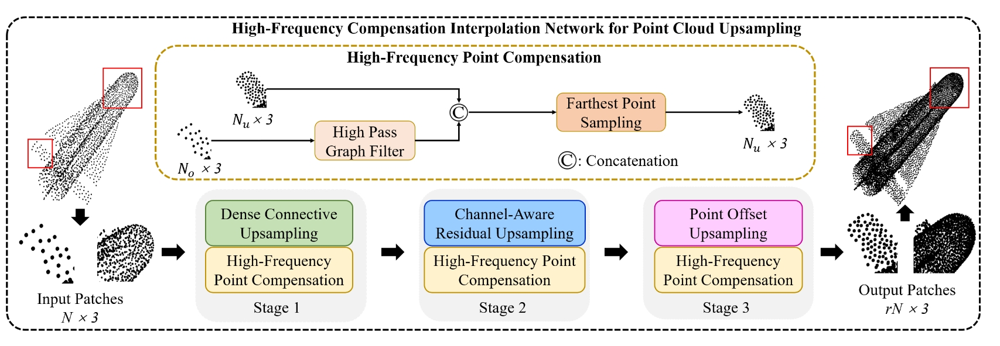

# HFCI-PU: High-Frequency Compensation Interpolation Network for Point Cloud Upsampling

 

## Introduction

This is the official Pytorch implementation of our paper "HFCI-PU: High-Frequency Compensation Interpolation Network for Point Cloud Upsampling" ([Paper](https://ieeexplore.ieee.org/document/10755974)) in IEEE Transactions on Instrumentation and Measurement (TIM) 2025. 

## Data Preparation

We use two public datasets, including PU1K ([Paper](https://arxiv.org/abs/1912.03264), [Download](https://drive.google.com/file/d/1oTAx34YNbL6GDwHYL2qqvjmYtTVWcELg/view?usp=sharing)), and PUGAN ([Paper](http://openaccess.thecvf.com/content_ICCV_2019/html/Li_PU-GAN_A_Point_Cloud_Upsampling_Adversarial_Network_ICCV_2019_paper.html), [Download](https://drive.google.com/open?id=13ZFDffOod_neuF3sOM0YiqNbIJEeSKdZ)),
PC2 ([Paper](https://arxiv.org/abs/2109.09337), [Download](https://drive.google.com/drive/folders/1Mam85gXD9DTamltacgv8ZznSyDBbBovv))


## Usage

The code is tested under Pytorch 1.9.0 and Python 3.6 on Ubuntu 18.04. Pretrained weights are available in 
[Pretrain (password: ssce)](https://pan.baidu.com/s/1PUT4PcjSrYmZM1cgzZEhYw)


1. Install python denpendencies.

```shell
pip install -r requirements.txt
```

2. Compile pyTorch extensions.

```shell
bash install.sh
```

3. Train the model. 

```shell
python HFCI_PU/main_HFCI_PU.py --phase "train"
```

4. Evaluate the model.

```shell
python HFCI_PU/main_HFCI_PU.py --phase "test_hfci_pu"
```

## License

This project is released under the [Apache 2.0 license](./LICENSE). Other codes from open source repository follows the original distributive licenses.


## Acknowledgement
Thanks for previous works [PC2-PU](https://github.com/chenlongwhu/PC2-PU), 
[PU-CRN](https://github.com/hikvision-research/3DVision/tree/main/PointUpsampling/PUCRN), 
[PUFA-GAN](https://github.com/hikvision-research/3DVision/tree/main/PointUpsampling/PUCRN),
and [PU-TF](https://github.com/rhtm02/PU-Transformer), as our codebase are mainly based on them.
Thanks for the reviewers' valuable comments on this paper.

## Citation
Please consider citing our paper in your publications if the project helps your research. BibTeX reference is as follows.


```BibTeX
@ARTICLE{10755974,
  author={Tang, Xiaolong and Shao, Feng and Chai, Xiongli and Chen, Hangwei and Jiang, Qiuping and Meng, Xiangchao and Ho, Yo-Sung},
  journal={IEEE Transactions on Instrumentation and Measurement}, 
  title={HFCI-PU: High-Frequency Compensation Interpolation Network for Point Cloud Upsampling}, 
  year={2025},
  volume={74},
  number={},
  pages={1-14},
  keywords={Point cloud compression;Correlation;Transformers;Interpolation;Feature extraction;Three-dimensional displays;Generative adversarial networks;Representation learning;Redundancy;Deep learning;Deep learning;high-frequency interpolation;point cloud upsampling (PCU);transformer},
  doi={10.1109/TIM.2024.3500074}}
```
